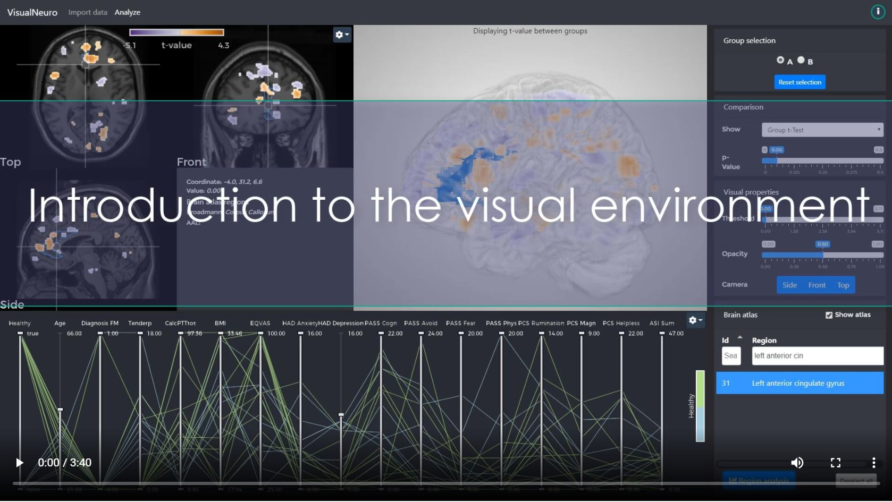

# VisualNeuro

Visual Neuro is a visual analysis tool understanding cohorts of brain imaging and clinical data.
Start analyzing your data:
1. Specify a folder where your brain imaging data are.
2. Specify a comma separated values (csv) file containing clinical data. One row per subject. One column must contain the filename of corresponding subjects brain imaging data, e.g. subject_001.nii

Project page and application binaries at [visualneruro.com](http://visualneuro.com/)

## Setup
Visual Neuro utilizes the [Inviwo visualization framework](https://inviwo.org/). You will first need to checkout the [Inviwo github repository]https://github.com/inviwo/inviwo].
- Follow the [Inviwo build instructions](https://inviwo.org/manual-gettingstarted-build.html)

### In CMAKE
- Set IVW_EXTERNAL_MODULES to the 'modules' folder of this repository
- Set IVW_EXTERNAL_PROJECTS to the 'apps' folder of this repository

See inviwo-projects-defaults.cmake for default minimal CMake settings. This file can be included to apply the settings automatically.

